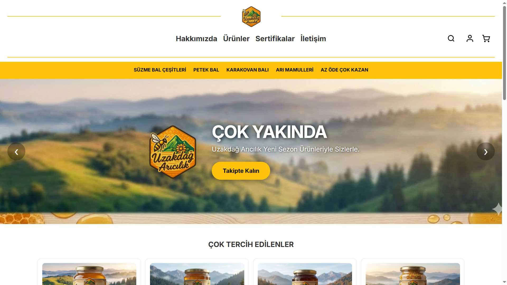

# 🚀 Premium Developer Portfolio - Glassmorphism Edition

Bu repo, modern, duyarlı (responsive) ve karanlık tema odaklı bir **Dijital Zanaatkar** portfolyosunu içermektedir. **Glassmorphism** tasarım diliyle hazırlanmış, performansı optimize edilmiş ve karmaşık problemleri kodla çözme tutkusuyla inşa edilmiştir.



## ✨ Özellikler

- **Modern Tasarım:** Saf CSS ile özelleştirilmiş glassmorphism efektleri ve modern tipografi.
- **Tam Duyarlı (Responsive):** Mobil, tablet ve masaüstü cihazlar için %100 uyumlu arayüz.
- **Bilingual (TR/EN) Desteği:** Çoklu dil desteği altyapısı (i18n).
- **Lightbox Entegrasyonu:** Proje görsellerine tıklandığında tam ekran görüntüleme özelliği.
- **EmailJS Entegrasyonu:** Backend gerektirmeden doğrudan JavaScript üzerinden çalışan iletişim formu.
- **Performans Odaklı:** Minimum harici kütüphane, optimize edilmiş görseller ve akıcı animasyonlar.

## 🛠️ Kullanılan Teknolojiler

- **Frontend:** HTML5, CSS3 (Vanilla), JavaScript (ES6+)
- **İletişim Sistemi:** [EmailJS](https://www.emailjs.com/)
- **İkonlar:** [FontAwesome 6](https://fontawesome.com/)
- **Yazı Tipleri:** [Google Fonts (Inter & Fira Code)](https://fonts.google.com/)

## 📁 Proje Yapısı

```text
portfolio/
├── css/
│   └── style.css       # Ana stil dosyası ve responsive ayarlar
├── js/
│   └── script.js      # Modal, lightbox ve EmailJS mantığı
├── images/            # Proje ekran görüntüleri ve varlıklar
└── index.html         # Ana yapı ve içerik
```

## 🚀 Hızlı Başlangıç

Bu projeyi yerelinizde çalıştırmak için:

1. Bu depoyu klonlayın:
   ```bash
   git clone https://github.com/sefaadam/portfolio.git
   ```
2. `portfolio` klasöründeki `index.html` dosyasını herhangi bir tarayıcıda açın.

### EmailJS Kurulumu (Kendi Siteniz İçin):
İletişim formunun çalışması için `js/script.js` dosyasındaki şu alanları kendi EmailJS bilgilerinizle doldurun:
- `emailjs.init("YOUR_PUBLIC_KEY")`
- `emailjs.sendForm('YOUR_SERVICE_ID', 'YOUR_TEMPLATE_ID', this)`

## 👤 İletişim

**Sefa Adam**  
- LinkedIn: [in/sefa-adam](https://www.linkedin.com/in/sefa-adam/)  
- Instagram: [@sefa.adam](https://www.instagram.com/sefa.adam/)  
- E-posta: [sefaadam57@gmail.com](mailto:sefaadam57@gmail.com)

---
*Özenle ve adanmışlıkla inşa edildi.* 💻
